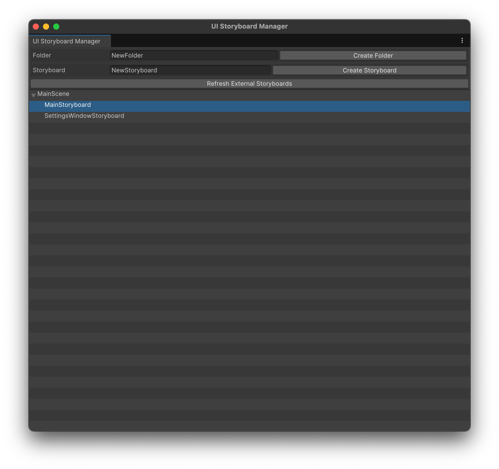
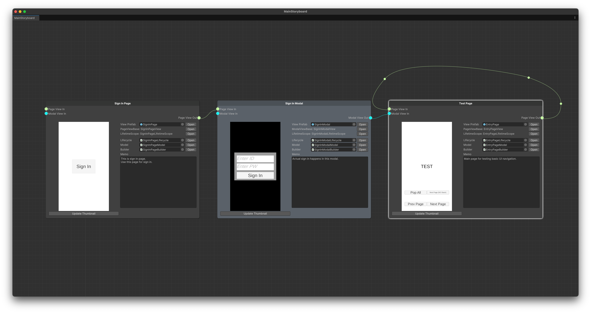

# Unity UI Storyboard

**Unity UI Storyboard** is a powerful collaboration and organization tool designed for creating and managing complex UI structures in Unity. It simplifies the process of designing, building, and maintaining structured UI systems, ensuring seamless collaboration between team members such as planners, UI/UX designers, and programmers.

## Why Use Unity UI Storyboard?

When working on games or apps with intricate UI structures, the biggest challenges are:
- Defining a clear and consistent architecture.
- Establishing and maintaining design rules.
- Facilitating effective communication across multiple disciplines.

Unity UI Storyboard addresses these challenges by providing a **well-structured project template** to kickstart your UI development. It helps maintain order throughout the project lifecycle, allowing teams to focus on their core tasks without constantly revisiting basic structural decisions.

---

## Design Philosophy

Unity UI Storyboard is built to support collaborative workflows and structured development. Here's what it enables:

### Key Features:
- Designed with **practical Clean Code principles**, promoting readability and maintainability.
- Incorporates **Dependency Injection**, enabling flexible and decoupled component management.
- Supports **view-level testing**, ensuring that each UI element can be independently verified and debugged.
- Provides a structure that simplifies applying these principles, helping teams implement clean, testable, and scalable UI designs effortlessly.

### What You Can Do:
- **Planners** can conceptualize and annotate UI prototypes as storyboards.
- **Designers** can craft visual layouts based on these prototypes.
- **Programmers** can implement the necessary logic based on the structured views.
- All team members can easily **review, verify, and refine** the UI design together.

### What It Doesn't Do:
- It does not automatically generate working UI elements by simply connecting nodes or creating layouts without code. Coding and implementation are still essential parts of the process.

---

For further documentation and usage guides, refer to the official [documentation](https://kwanjoong-dev.gitbook.io/unity-ui-storyboard).

---